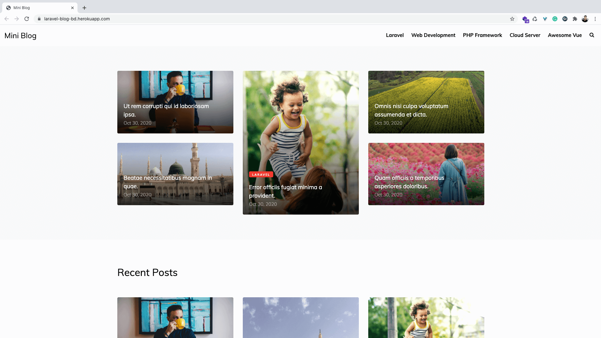
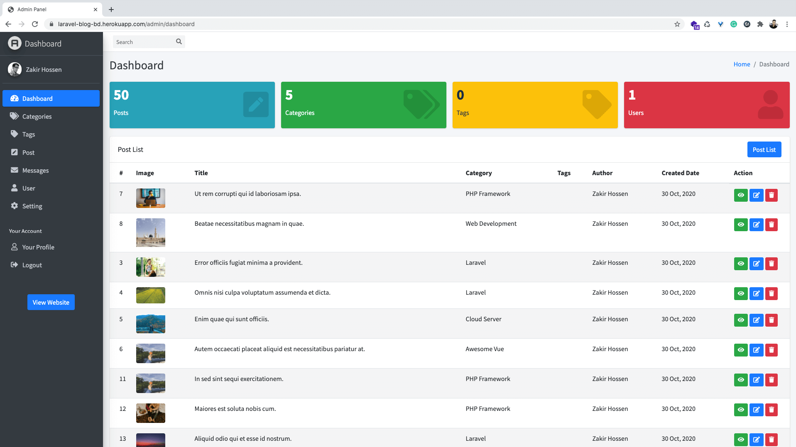

# Laravel Complete Blog Development
This is a Blog Development Tutorial Series on Youtube. This project is made by <a href="https://zakirhossen.com" target="_blank">Zakir Hossen</a> for the tutorial Purpose.

## Tutorial Link
- [Series Prview Link](https://www.youtube.com/watch?v=CEYYeeM763E&list=PLl4v4A2HI0YixTm5AsoTu-sKxiQti4-r6&index=1&t=1s)
- [Youtube Playlist Link](https://www.youtube.com/playlist?list=PLl4v4A2HI0YixTm5AsoTu-sKxiQti4-r6)

## Project Live Link
[Live Link ⇨ ](https://laravel-blog-bd.herokuapp.com/)

#### Project Key Matrics
- Laravel v7.0
- Frontend Template [(MiniBlog by Colorlib)](https://colorlib.com/wp/template/miniblog/)
- Admin Template [(Admin LTE 3)](https://adminlte.io/themes/dev/AdminLTE/index.html)


#### Frontend Screenshot


#### Backend Screenshot


To deploy your Laravel project using Nginx, MySQL, and an SSL certificate on an Ubuntu server, and then upload a README file to your GitHub repository, follow these steps:

### 1. **Set Up Your Server**
- **Update your server:**
  ```bash
  sudo apt update && sudo apt upgrade -y
  ```

- **Install necessary packages:**
  ```bash
  sudo apt install nginx mysql-server php-fpm php-mysql git -y
  ```

- **Secure MySQL:**
  ```bash
  sudo mysql_secure_installation
  ```
  Follow the prompts to set a root password, remove anonymous users, disallow root login remotely, and remove the test database.

### 2. **Set Up MySQL Database**
- **Login to MySQL:**
  ```bash
  sudo mysql -u root -p
  ```
  
- **Create a database and user for your Laravel project:**
  ```sql
  CREATE DATABASE laravel_db;
  CREATE USER 'laravel_user'@'localhost' IDENTIFIED BY 'password';
  GRANT ALL PRIVILEGES ON laravel_db.* TO 'laravel_user'@'localhost';
  FLUSH PRIVILEGES;
  EXIT;
  ```

### 3. **Set Up Laravel**
- **Clone your Laravel project:**
  ```bash
  cd /var/www/html
  sudo git clone https://github.com/yourusername/your-laravel-project.git
  cd your-laravel-project
  ```

- **Install Composer dependencies:**
  ```bash
  sudo apt install composer -y
  composer install
  ```

- **Set up environment file:**
  ```bash
  cp .env.example .env
  nano .env
  ```
  Update the `.env` file with your database and other configuration details:
  ```env
  DB_DATABASE=laravel_db
  DB_USERNAME=laravel_user
  DB_PASSWORD=password
  ```

- **Generate an application key:**
  ```bash
  php artisan key:generate
  ```

### 4. **Set Up Nginx**
- **Create a new Nginx configuration file:**
  ```bash
  sudo nano /etc/nginx/sites-available/laravel
  ```

- **Add the following configuration:**
  ```nginx
  server {
      listen 80;
      server_name your_domain_or_IP;
      root /var/www/html/your-laravel-project/public;

      index index.php index.html index.htm index.nginx-debian.html;

      location / {
          try_files $uri $uri/ /index.php?$query_string;
      }

      location ~ \.php$ {
          include snippets/fastcgi-php.conf;
          fastcgi_pass unix:/var/run/php/php7.4-fpm.sock;
          fastcgi_param SCRIPT_FILENAME $document_root$fastcgi_script_name;
          include fastcgi_params;
      }

      location ~ /\.ht {
          deny all;
      }
  }
  ```

- **Enable the configuration and restart Nginx:**
  ```bash
  sudo ln -s /etc/nginx/sites-available/laravel /etc/nginx/sites-enabled/
  sudo nginx -t
  sudo systemctl restart nginx
  ```

### 5. **Set Up SSL with Certbot**
- **Install Certbot and the Nginx plugin:**
  ```bash
  sudo apt install certbot python3-certbot-nginx -y
  ```

- **Obtain and install the SSL certificate:**
  ```bash
  sudo certbot --nginx -d your_domain_or_IP
  ```

- **Follow the prompts to configure the SSL certificate.**

### 6. **Set Up Permissions**
- **Give Nginx ownership of the Laravel directory:**
  ```bash
  sudo chown -R www-data:www-data /var/www/html/your-laravel-project
  sudo chmod -R 755 /var/www/html/your-laravel-project
  ```

### 7. **Finalize the Laravel Setup**
- **Run migrations:**
  ```bash
  php artisan migrate
  ```

- **Optimize Laravel:**
  ```bash
  php artisan optimize
  ```


